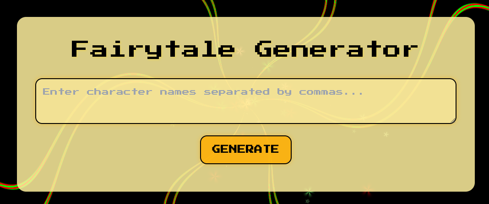

# Отчёт
## Тема курсовой работы:
## Генератор сказок с картинками

## Техническое задание
-	Приложение включает минимум 2 бэкенд сервиса
-	Каждый сервис должен запускаться в виде отдельного инстанса
-	Переменные окружения каждого сервиса вынесены в .env файле (в репозитории должен быть файл .env.example)
-	Коммуникация между сервиса может осуществляться через: Rest API, grpc, брокер сообщений 
-	База данных описана в docker-compose файле
-	БД в docker-compose для инициализации использует переменные из .env файла
-	В проекте есть файл requirements.txt со списком всех библиотек проекта
-	Каждый сервис содержит Readme файл с указанием задач сервиса, логики работы и инструкцию по запуску

## Описание

Проект представляет из себя генератор небольших историй-сказок с картинками. Проект включает в себя несколько микросервисов, которые взаимодействуют через API.

Все микросервисы запущены в отдельных docker контейнерах.

Проксирование портов описано в docker-compose.yml

## Основные функции

- **story_service**: Обрабатывает ввод пользователя и выводит данные.
- **yc_access_service**: Осуществляет периодическое обновление токенов для доступа к Yandex Cloud Api
- **llm_manager_service**: Предоставляет доступ к LLM (генерация текста).
- **vlm_manager_service**: Предоставляет доступ к VLM (генерация изображений).
- **Nginx**: Выступает в роли прокси-сервера для маршрутизации запросов на машине.
- **Redis**: Используется для кэширования и хранения токенов.

## Основная логика работы
Пользовательский интерфейс написана на стандартном стеке html, css, javascript.

В JS открыты два сокета, с помощью которых **story_service** общается с другими микросервисами.

После нажатия кнопки введённые в поле для ввода персонажи сказки парсятся, после чего отправляется POST-запрос **llm_manager_service** для генерации истории.
<div style="text-align: center;">
    
</div>

<div style="text-align: center;">
Рисунок - Поле ввода
</div>

После чего **llm_manager_service** формирует промпт (запрос) к языковой модели яндекса (*llm_manager_service/app/api/utils.py: send_completion_request*)

Благодаря выставленному флагу
```JSON
"stream": true
```
API Яндекса начинает потоковую передачу сгенерированных символов - токенов.

**llm_manager_service** начинает принимать части конечного ответа (чанки) и отправляет их в открытый **storySocket**. (*index.html: 401 строка*)

При формировании промпта была указана инструкция для языковой модели, чтобы она сама расставила по тексту места для картинок с помощью символа *"@"*.

story_service с помощью JS, принимая пришедшие чанки текста, проверяет наличие этого "управляющего" символа. Если он встречается в чанке, то убирает его и отправляет запрос в **imageSocket** (*index.html: 402 строка*)

llm_manager_service, подключенный к **imageSocket** отправляет запрос к API Yandex ART, ему в ответ возвращается ID запрошенной картинки, после чего сервис начинает проверку готовности сгенерированного сообщения, отправляя на API запросы.

Как только изображение принимается (в кодировке base64), оно передаётся обратно на открытый **imageSocket**.
<br></br>

## Описание API Yandex Cloud
### Генератор текста
Для генерации историй (микросервис llm_manager_service) была выбрана модель YandexGPT.

Для взаимодействия с API необходим временный *IAM*-токен, который генерируется раз в 59 минут (время истекания - 60 минут) с помощью сервиса yc_access_service. Процесс генерации состоит из двух этапов:
1) Генерация JWT-токена (*yc_access_service/main.py: fetch_iam_token*)
2) Обмен JWT на IAM-токен (*yc_access_service/main.py: exchange_jwt_for_iam_token*)

JSON-файл, отправляемый модели имеет следующую конфигурацию:
```json
{
  "modelUri": "gpt://<идентификатор_каталога>/yandexgpt-lite",
  "completionOptions": {
    "stream": false,
    "temperature": 0.1,
    "maxTokens": "2000"
  },
  "messages": [
    {
      "role": "system",
      "text": "Переведи текст"
    },
    {
      "role": "user",
      "text": "To be, or not to be: that is the question."
    }
  ]
}
```

На основной страничке с фронтендом сервис подключен к сокету **storySocket** (*story_service/templates/index.html: 401 строка*)

### Генератор изображений
Для генерации иллюстраций к историям (микросервис vlm_manager_service) была выбрана модель YandexART.

Для взаимодействия с API также необходим временный *IAM*-токен, процесс генерации которого был описан чуть выше.

JSON-файл, отправляемый модели имеет следующую конфигурацию:
```json
{
"modelUri": "art://<идентификатор_каталога>/yandex-art/latest",
"generationOptions": {
  "seed": "1863",
  "aspectRatio": {
     "widthRatio": "2",
     "heightRatio": "1"
   }
},
"messages": [
  {
    "weight": "1",
    "text": "узор из цветных пастельных суккулентов разных сортов, hd full wallpaper, четкий фокус, множество сложных деталей, глубина кадра, вид сверху"
  }
]
}
```

На основной страничке с фронтендом сервис подключен к сокету **imageSocket** (*story_service/templates/index.html: 402 строка*)

## Взаимодействие с базой данных
Для хранения данных была выбрана redis.
Соответствующий сервис разворачивается на 6379 порту (*docker-compose.yml*).

База данных хранит следующие данные:
1) *IAM-token:* токен для доступа к сервисам Yandex Cloud
2) *FOLDER_ID:* ID папки в Yandex Cloud

Каждый сервис, которому требуются эти ключи обращается к БД следующим образом:
```python
IAM_TOKEN = redis.Redis(host='redis', port=6379, db=0).get('IAM_TOKEN').decode('utf-8')
```

## Проксирование портов
Для корректного взаимодействия с сервисами на локальной машине и извне был настроен проксирующий nginx-сервер, который перенаправляет полученные запросы на необходимые порты.

Конфигурация описана в файле *nginx_config.conf*

Порты в контейнерах же маппятся с помощью описанного под ключом "ports" маппинга в каждом сервисе (это позволяет в контейнере использовать стандартные порты для удобства)

## Описание микросервисов
### 1. Story Service

#### Описание
Является основным микросервисом.

Обеспечивает взаимодейтсвие пользователя с приложением.

Осуществляет запросы к llm_manager_service и к vlm_manager_service

Обеспечивает фронтенд

#### Endpoints
*'/':*
- Выводит страничку пользователю
- Принимает ввод от пользователя на страничке и направляет его в соответствующие микросервисы
- Выдаёт пользователю пришедшие по вебсокетам вывод из микросервисов

#### Запуск
Микросервис запускается автоматически.
Его можно запустить отдельно с помощью команды:
```bash
uvicorn app.main:app --reload --host 0.0.0.0 --port 8000
```

Так как микросервис работает в контейнере, докер маппит запросы с ожидаемого порта (8001) на 8000

### 2. Large Language Model Service
### LLM Manager Service

#### Описание
Микросервис обеспечивает взаимодейтсвие с API Yandex cloud.

#### Endpoints
*generate_story:*
- Принимает вебсокет, в который будет записан текст
- Осуществляет запрос к Yandex Cloud для генерации текста

#### Запуск
Микросервис запускается автоматически.
Его можно запустить отдельно с помощью команды:
```bash
uvicorn app.main:app --reload --host 0.0.0.0 --port 8000
```

Так как микросервис работает в контейнере, докер маппит запросы с ожидаемого порта (8002) на 8000

### 3. Visual Language Model Service
### VLM Manager Service

#### Описание
Микросервис обеспечивает взаимодейтсвие с API Yandex cloud.

#### Endpoints
*generate_image:*
- Принимает вебсокет, в который будет записано изображение
- Осуществляет запрос к Yandex Cloud для генерации изображения

#### Запуск
Микросервис запускается автоматически.
Его можно запустить отдельно с помощью команды:
```bash
uvicorn app.main:app --reload --host 0.0.0.0 --port 8000
```

### 4. Yandex Cloud Access Service
### YC Access Service

#### Описание
Микросервис обеспечивает возможность взаимодейтсвия с API Yandex cloud для других сервисов.
Осуществляет генерацию JWT-токенов для последующего обмена с IAM-токенами от YC.

#### Запуск
Микросервис запускается автоматически.
Его можно запустить отдельно с помощью команды:
```bash
python app/main.py
```

Для работы микросервиса также необходимо установить переменную *YC_KEYS_PATH*, которая отвечает за путь к файлу со следующим содержимым:
```
    "private_key" 
	"key_id"
	"service_account_id"
	"folder_id"
```


Так как микросервис работает в контейнере, докер маппит запросы с ожидаемого порта (8003) на 8000

## Установка

Для установки и запуска проекта выполните следующие шаги:

1. **Клонируйте репозиторий:**

    ```bash
    git clone https://github.com/matveeey/fairytale_service.git
    cd  fairytale_service
2. **Создайте файл .env и установите необходимые переменные окружения:**

    ```bash
    cp .env.example .env
    ```

3. **Откройте файл .env и установите следующие переменные:**

    ```bash
    YC_KEYS_PATH=app/keys/_keys.json
    ```

4. **Запустите проект с помощью Docker Compose:**
    
    ```bash
    docker-compose up --build
    ```

## Переменные окружения

Для корректной работы проекта необходимо установить следующие переменные окружения:

    YC_KEYS_PATH: Путь к файлу с ключами для доступа к Yandex Cloud.

## Ключи для доступа к Yandex Cloud
В файле с ключами *keys/_keys.json* необходимо описать:
```
    "private_key" 
	"key_id"
	"service_account_id"
	"folder_id"
```

## Зависимости

Более подробно все зависимости описаны в *requirements.txt* соответствующего сервиса

# Вывод
Проект выполнил поставленные задачи.
Коммуникация между сервисами осуществляется через REST API.
Разделение приложения на сервисы упрощает разработку и масштабирование. 
Использование переменных среды позволяет осуществлять удобное взаимодействие между контейнерами, повышает удобство использования, а также позволяет скрыть приватные данные от посторонних лиц при разработке (например, при использовании систем контроля версий).
Каждый сервис имеет описание в *README* файле, а также список зависимостей в *requirements.txt*.